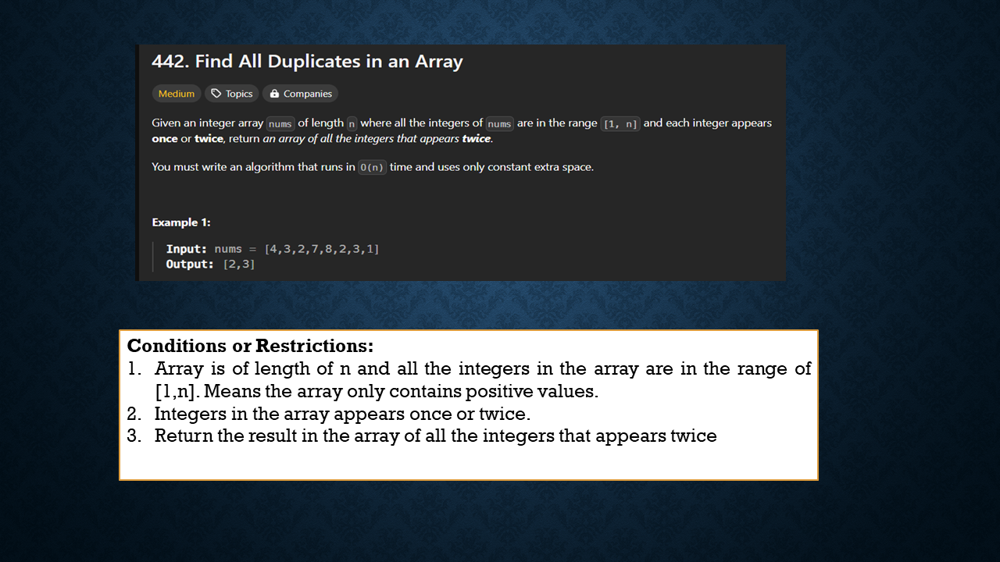
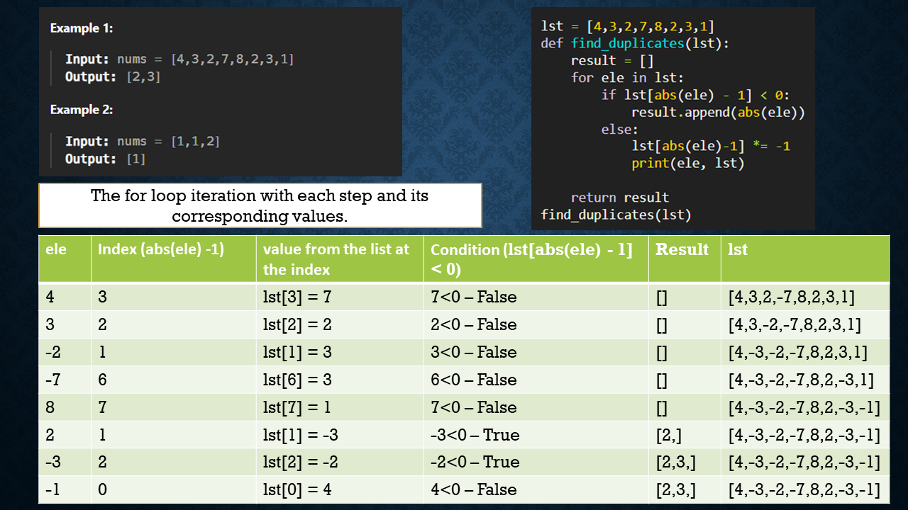

## I. MaxProduct
For the maxProduct you must answer the following question 
1. How does the first solution with two loops tackle the problem? What is it is time and space complexity and how do you know this?
   
   ~~~python
   from typing import List
   nums = [1,5,4,5]
   def maxProduct(nums: List[int]) -> int:
      length = len(nums)
      max_prod = 0
      max_indices = (0, 0)
      for i in range(length):
         current_val = nums[i]
         j = i + 1
         while j < length:          
               next_val = nums[j]
               prod = current_val * next_val
               if prod > max_prod:
                  max_vals = (nums[i], nums[j])
                  max_prod = prod
               j += 1
      i, j = max_vals      
      max_prod = (i-1) * (j-1)    
      return max_prod
            
   maxProduct(nums)
   ~~~
   
    ### Explanation :  
     First, we initialize three variables: `length` (which stores the length of the list), `max_prod` (initialized to 0), and `max_indices` (initialized to (0, 0)). The outer for loop `for i in range(length)` iterates through each element in the list, with `i` being the index of the current element. The inner while loop `while j < length` iterates through the elements starting from the next element of the outer loop (`j` starts from `i + 1`). Inside the inner while loop, we calculate the product of the two elements `nums[i]` and `nums[j]` as `prod`. If `prod` is greater than `max_prod`, we update `max_vals` with the current pair and set `max_prod` to `prod`. We then increment `j` until the end of the list. After iterating through all the elements, we find the maximum product and return `max_prod`.

     ### Time and Space Complexity
      The time complexity of this solution is \(O(n^2)\) because it uses two nested loops, each iterating through the list. The outer loop runs \(n\) times, and the inner loop runs approximately \((n-1)\) times on average, leading to \(O(n^2)\) overall. The space complexity is \(O(1)\) since only a constant amount of extra space is used for variables, regardless of the input list size.

2. How does the second solution using sorting work? What is the time and space complexity and how do you know this?

   ~~~python
   nums = [1,5,4,5]
   def maxProduct(nums: List[int]) -> int:
      nums.sort() # n log n
      length = len(nums)
      return (nums[length-1]-1) * (nums[length-2]-1)
   maxProduct(nums)
   ~~~
   ### Explanation :  
   In the second solution, the list `nums` is sorted in ascending order. The variable `length` stores the length of the list. After sorting, the maximum product is calculated by selecting the two largest elements from the sorted list. Specifically, the code retrieves the last two elements, subtracts 1 from each, and calculates their product. However, this approach does not account for cases where the list contains negative values. Multiplying two negative values could yield a positive product, which is not considered in this solution. Therefore, this code might not always produce the correct result, and a more comprehensive approach is needed to handle all scenarios effectively.

   ### Time and Space Complexity:
   **Time Complexity**: The time complexity is \(O(n \log n)\) due to the sorting operation. Accessing the last two elements and performing arithmetic operations are \(O(1)\).

   **Space Complexity**: The space complexity is \(O(1)\) since the sorting is done in place, and no additional space is required.

3. How does the third solution work? How can you modify it to handle the case for two large negative numbers?  What is the time and space complexity and how do you know this? What is the main trick or insight that you learned from the final solution? HINT: How are you storing two max or two min values in just one loop. 

   ~~~python
   nums = [10,2,5,2]
   def maxProduct(nums: List[int]) -> int:
      max_val = 0
      max_val_1 = 0
      for val in nums:
         if val >= max_val:
               max_val_1 = max_val
               max_val = val
               print(max_val, max_val_1)
         elif val > max_val_1:
               max_val_1 = val
               
      return (max_val-1) * (max_val_1-1)
      
   maxProduct(nums)   
   ~~~

   ### Explanation of the above code:
   The third solution finds the two largest values in the list in a single pass. First, it initializes two variables, `max_val` and `max_val_1`, and sets both to zero. The for loop iterates through the list, updating `max_val` by comparing it with each value and also updating `max_val_1` with the previous `max_val`. Finally, it calculates the maximum product by subtracting 1 from both `max_val` and `max_val_1` and multiplying the results.

   But the above code does not handle the negative values. To handle the case for two large negative numbers. here is the code

   ~~~python
   nums = [-100,-99,3,4]
   def maxProduct(nums: List[int]) -> int:
      max_val = float('-inf')
      max_val_1 = float('-inf')
      min_val = float('inf')
      min_val_1 = float('inf')
      for val in nums:
         if val > max_val:
               max_val_1 = max_val
               max_val = val
         elif val > max_val_1:
               max_val_1 = val
               
         if val < min_val:
               min_val_1 = min_val
               min_val = val
         elif val < min_val_1:
               min_val_1 = val
         
      max_res = (max_val-1) * (max_val_1-1)
      min_res = (min_val-1) * (min_val_1-1)

      return max(max_res, min_res)
      
   maxProduct(nums) 
   ~~~ 
   ### Explanation of the above code:

   The main goal is to find the two largest numbers and the two smallest numbers, and the function will return the maximum product from these two sets. It initializes `max_val` and `max_val_1`, setting both to `float('-inf')` (negative infinity), and `min_val` and `min_val_1`, setting both to `float('inf')` (positive infinity). To find the minimum values, the function iterates through the list, storing the minimum value in `min_val` by comparing it with each value and updating `min_val_1` to the previous `min_val`. Finally, it calculates the product of the two largest values and the product of the two smallest values, returning the maximum of these two values.

   ### Time and Space Complexity:
   The time complexity of this solution is \(O(n)\) because it makes a single pass through the list. The space complexity is \(O(1)\) because it uses a constant amount of extra space for the variables `max_val`, `max_val_1`, `min_val`, and `min_val_1`. 
   The main trick or insight from the final solution is its ability to find the two largest and two smallest numbers in a single pass. This is the most optimized solution compared to the first and second solutions, as it finds the maximum product in a single pass and handles all cases, including negative values. The function efficiently tracks both the two largest and two smallest numbers to ensure accuracy.

## II. Find_Duplicates
For the find_duplicates problem, you must answer the following questions:
1. How does the first solution using set and dictionary work? What is it is time and space complexity and how do you know this? Also, does it meet the criteria set by the problem?

   ~~~python
   lst = [1, 3, 1, 3, 5, 1, 4, 7, 7]
   def find_duplicates(lst):
      counter = {}
      
      for val in lst:
         if val not in counter:
            counter[val] = 0
         counter[val] += 1
         
      result = []
      for val, count in counter.items():
         if count > 1:
            result.append(val)

      print(counter)
      return result

   find_duplicates(lst)
   ~~~
   ## Explanation :
   The first solution finds duplicates in a list using a dictionary to count occurrences of each element. First, we initialize `counter` as an empty dictionary. Using a for loop, we iterate through the list, checking if each element is in the dictionary. If the element is not in the dictionary, it is added with an initial count of 0; otherwise, its count is incremented by 1 because it is a duplicate element. In the second for loop, we iterate over the dictionary, and if the count of a value is greater than 1, we append it to a list called `result`. Finally, we return the `result` list.

   ## Time and Space Complexity:

   The time complexity of this solution is \(O(n)\), where \(n\) is the length of the list. This is because it iterates through the list once to count elements and once more to collect duplicates. The space complexity is also \(O(n)\) due to the additional storage required for the dictionary.

   This solution does not meet the criteria set by the problem as in the problem it is mentioned as we have to implement it in constant space \(O(1)\).

2. How does the second solution work using a list to mark things as seen?  What is it is time and space complexity and how do you know this? 

   code using dict:
   ~~~python
   lst = [1, 3, 1, 3, 5, 1, 4, 7, 7]
   def find_duplicates(lst):
      result = []
      seen = {}
      
      for val in lst:
         if val not in seen:
               seen[val] = 1
         else:
               result.append(val)
               
      return result
   find_duplicates(lst)
   ~~~

   code using set:
   ~~~python
   lst = [1, 3, 1, 3, 5, 1, 4, 7, 7]
   def find_duplicates(lst):
      result = []
      seen = set()
      
      for val in lst:
         if val not in seen:
               seen.add(val)
         else:
               result.append(val)
               
      return result
   find_duplicates(lst)
   ~~~
   ## Explanation:
   The second solution finds duplicates in a list using a set or dict to keep track of elements that have already been seen. 
   The function iterates through each element in the list `lst`. For each element, if it is not in the `seen` set, it is added to the set. If the element is already in the set, it means it is a duplicate, so it is appended to the `result` list.

   ### Time and Space Complexity

   - **Time Complexity**: The time complexity is \(O(n)\), where \(n\) is the length of the list. This is because each element is visited once.
   - **Space Complexity**: The space complexity is \(O(n)\) because, in the worst case, the set can store all unique elements from the list.

3. Consider creating powerpoint slides to show how the list solution works by stepping through array one step at a time. You can also put your drawing or visual aids on paper and scan it or take a picture of it. 
   ~~~python
   lst = [4,3,2,7,8,2,3,1]
   def find_duplicates(lst):
      result = []
      for ele in lst:
         if lst[abs(ele) - 1] < 0:
               result.append(abs(ele))
         else:        
               lst[abs(ele)-1] *= -1
               print(ele, lst)
               
      return result
   find_duplicates(lst)
   ~~~
   ### Explanation of the List Solution

   The list solution finds duplicates in an array by using the array itself to track seen elements. As per the question the list is assumed to contain all elements in the range [1, n], meaning it only includes positive integers. The function iterates through each element `ele` in the list `lst`. For each element, it determines the index to check by `abs(ele) - 1`. It then accesses the element at this index in the list. If the value at this index is greater than zero, the function multiplies the value at this index by `-1` to mark the element as seen. If the value is less than zero, it indicates that the element has already been visited, meaning a duplicate has been found. The function appends the duplicate value to the `result` list. After iterating through all elements, the function returns the `result` list containing all duplicate elements.

   ### Time and Space Complexity

   - **Time Complexity**: The time complexity is \(O(n)\), where \(n\) is the length of the list. Each element is visited once.

   - **Space Complexity**: The space complexity is \(O(1)\) because the solution modifies the input list in place. Hence the algorithm has constant space.

   ### Visual Aid:

   ## Presentation slides

   ### Slide 1  
   

   ### Slide 2  
   

