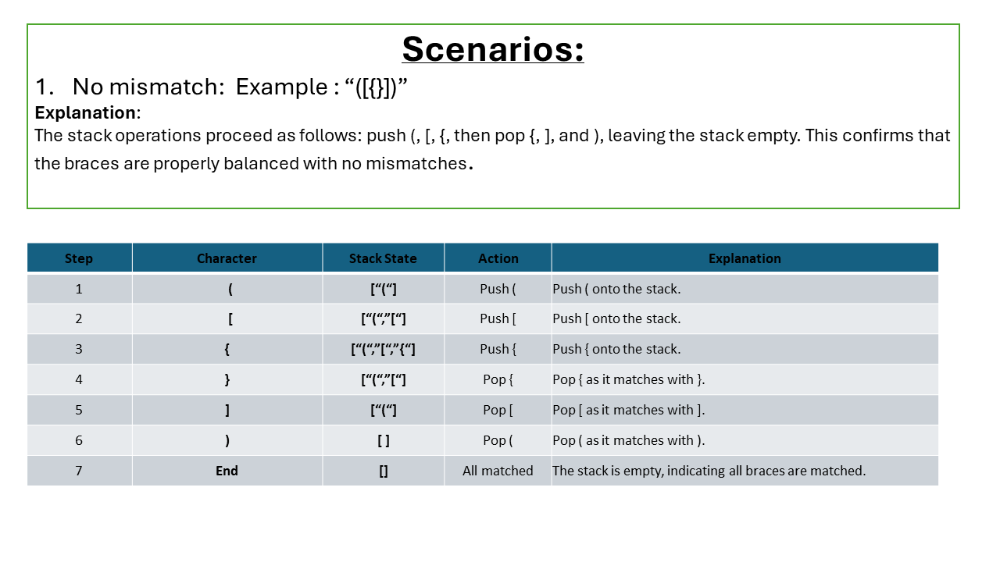
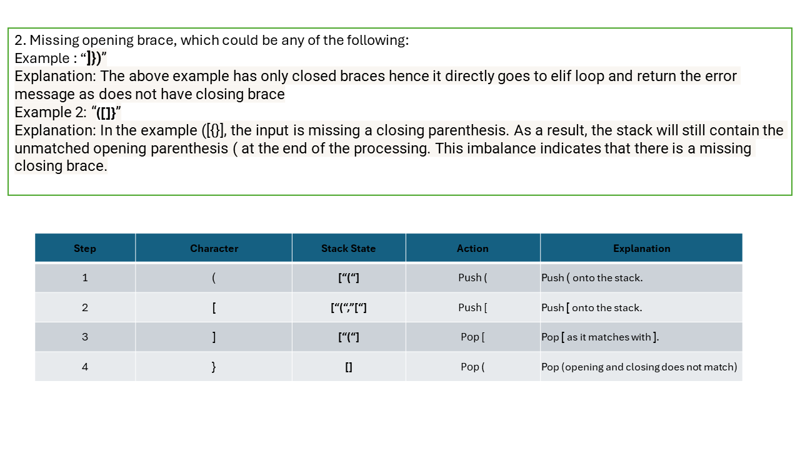
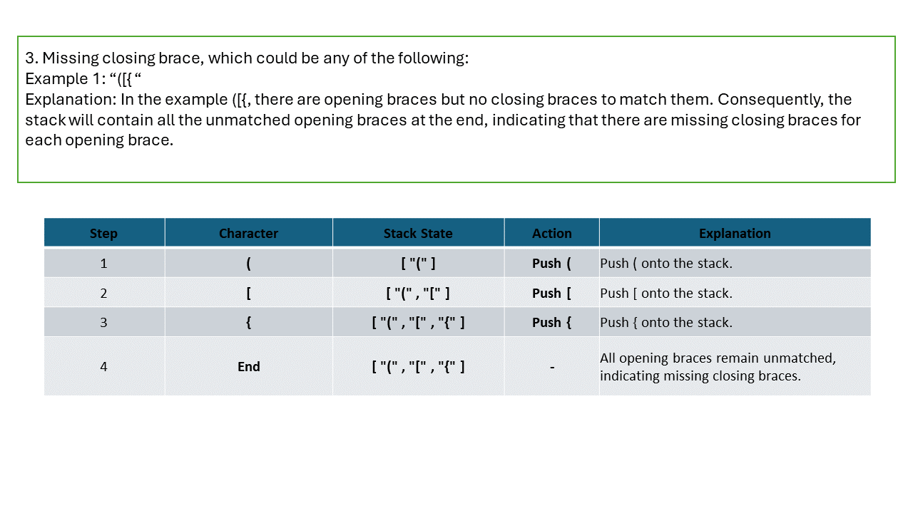

# Stack:
A Stack is a linear data structure that follows a particular order in which the operations are performed. The order may be LIFO(Last In First Out) or FILO(First In Last Out). LIFO implies that the element that is inserted last, comes out first and FILO implies that the element that is inserted first, comes out last.

## Key Operations on Stack Data Structures
**Push**: Adds an element to the top of the stack. 
**Pop**: Removes the top element from the stack. 
**Peek**: Returns the top element without removing it. 
**IsEmpty**: Checks if the stack is empty. 
**IsFull**: Checks if the stack is full (in case of fixed-size arrays). 

Note : Stack is considered an abstract data type because it is built on top of other built-it data structures.

## Implementation:

Code:
~~~python
class Stack:
    def __init__(self):
        self.stack = []

    def is_empty(self):
        return len(self.stack) == 0

    def push(self, v):
        self.stack.append(v)

    def pop(self):
        if self.is_empty():
            raise Exception('Stack is empty.')
        return self.stack.pop()
    def read(self): #peak
        if self.is_empty():
            return None
        return self.stack[-1]

    def __repr__(self):
        return "stack:" + str(self.stack)
~~~
**Explanation:** 
The `Stack` class implements a basic stack data structure using a Python list. It includes methods to check if the stack is empty (`is_empty`), add an element to the top of the stack (`push`), remove and return the top element (`pop`), and retrieve the top element without removing it (`read`). The `__repr__` method provides a string representation of the stack for easy visualization.

**Time Complexity**: 
The time complexity for the `push`, `pop`, and `read` (peek) operations in the `Stack` class using list is O(1), as these operations involve either appending or removing an element from the end of a list, or accessing the last element, all of which are constant time operations. Checking if the stack is empty (`is_empty`) also takes O(1), as it involves comparing the length of the list to zero.

**Implementing a stack using a list versus a linked list**: 
As mentioned above, the time complexity (TC) of a stack implemented using a list is O(1) on average and O(N) in the worst case. Both list.append() and list.pop() have O(1) amortized time complexities. When a stack is implemented using a linked list, the time complexity depends on the implementation. If you implement it with insertions and deletions at the head, then the time complexity for insertion, deletion, and reading the top element is O(1). However, if insertions and deletions are done at the tail, the operations have a time complexity of O(N). Ultimately, the time complexity of a linked list implementation depends on how the linked list is structured.

# Stack as a Linter:
A stack can be utilized as a linter to check for balanced parentheses in code. The idea is to push opening braces onto the stack and pop them when a respective closing brace is encountered. If at any point the closing brace is not match the opening brace, we know there is a mismatch. 
## Code Implementation
The following code demonstrates how to use a stack to achieve linting functionality:
~~~python
class Linter:
    def __init__(self):
        self.stack = Stack()

    def is_opening_brace(self, char):
        return char in '([{'

    def is_closing_brace(self, char):
        return char in ')]}'

    def is_not_a_match(self, opening_brace, closing_brace):
        braces = {
            '(': ')',
            '[': ']',
            '{': '}',
        }
        return closing_brace != braces[opening_brace]

    def lint(self, text):
        for char in text:
            if self.is_opening_brace(char):
                self.stack.push(char)
            elif self.is_closing_brace(char):
                if self.stack.is_empty():
                    return f'{char} does not have opening brace'
                popped_opening_brace = self.stack.pop()
                if self.is_not_a_match(popped_opening_brace, char):
                    return f'{char} has mismatched opeing brace'
        if self.stack.read():
            return f'{self.stack.read()} does not have closing brace'

        return True
~~~
**Explanation**: 
The Linter class uses a stack to check for matching opening and closing braces in a given text. It defines methods to identify opening and closing braces and to determine if a pair of braces matches. The lint method iterates through each character in the text, pushing opening braces onto the stack and popping them when a closing brace is encountered. If there is no matching opening brace for a closing brace or if any opening braces are left unmatched at the end, it returns an error message. If all braces match correctly, it returns True.

### Visual Aid:

### Scenarios and explanations:

### Slide 1  

### Slide 2  

### Slide 3  

   

