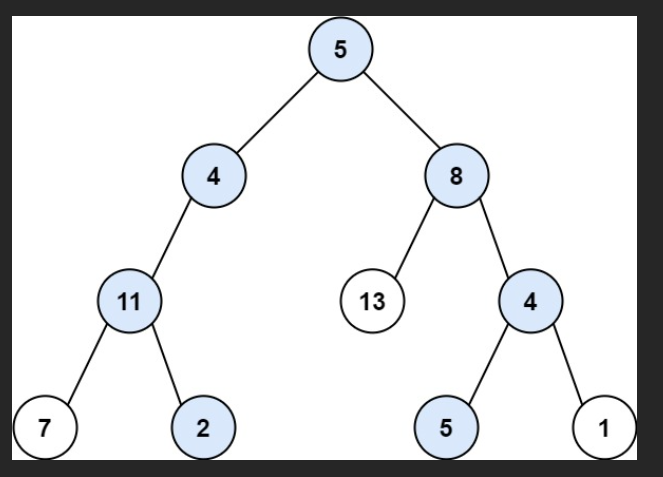

##                                    Video Assignment - Path Sum 2
### Depth First Search (DFS):
**Depth-first search** is an algorithm for traversing or searching tree or graph data structures. The algorithm starts at the root node and explores as far as possible along each branch before backtracking.

### Breath First Search (BFS): 
**Breadth First Search (BFS)** is a graph traversal algorithm that explores all the vertices in a graph at the current depth before moving on to the vertices at the next depth level. It starts at a specified vertex and visits all its neighbors before moving on to the next level of neighbors.

### Path Sum II: 
**Problem Statement:**
Given the root of a binary tree and an integer targetSum, return all root-to-leaf paths where the sum of the node values in the path equals targetSum. Each path should be returned as a list of the node values, not node references.

A root-to-leaf path is a path starting from the root and ending at any leaf node. A leaf is a node with no children.
Explanation: As the problem states we have to explore all the paths from root-to-leaf hence we use DFS rather than BFS.

Example:
<!--  -->

 
Input: root = [5,4,8,11,null,13,4,7,2,null,null,5,1], targetSum = 22 
Output: [[5,4,11,2],[5,8,4,5]] 
Explanation: There are two paths whose sum equals targetSum: 
5 + 4 + 11 + 2 = 22 
5 + 8 + 4 + 5 = 22

Code:
~~~python
# Definition for a binary tree node.
# class TreeNode:
#     def __init__(self, val=0, left=None, right=None):
#         self.val = val
#         self.left = left
#         self.right = right
class Solution:
    def pathSumUtill(self, root, CurPath, MatPath,target):# Utility function for recurssion as we need global variables
        if(root is None): 
            return
        CurPath.append(root.val)  # keep track of current path  
        value = root.val
        if(value == target and root.left is None and root.right is None): # Check if it's a leaf node and value is target
            MatPath.append(list(CurPath))
        else:
            # Recursively call for left and right children
            self.pathSumUtill(root.left, CurPath, MatPath, target-root.val)  # Exploring all the left node paths
            self.pathSumUtill(root.right, CurPath, MatPath, target-root.val)  # Exploring all the right node paths
        CurPath.pop()   # Backtrack by removing the current node from the path
        return MatPath
    def pathSum(self, root: Optional[TreeNode], targetSum: int) -> List[List[int]]:
        CurPath = []   # Global variable keep tracks of the path in each recursion
        MatPath = []   # Global variable keep tracks of the path which are equal to target sum in each recursion
        return self.pathSumUtill(root, CurPath, MatPath, targetSum)  # calling the recursive function
~~~

**Code explnation:** 
The `Solution` class contains two methods: `pathSumUtill` and `pathSum`.

The `pathSumUtill` method is a recursive utility function that helps in finding the paths. It takes the current node (`root`), the current path (`CurPath`), a list to store all valid paths (`MatPath`), and the remaining target sum (`target`). It starts by checking if the current node is `None`; if it is, the function returns. It then adds the current node's value to `CurPath`. If the current node is a leaf (no left or right child) and its value equals the remaining target, the current path is added to `MatPath`. Otherwise, the function recursively explores the left and right children, adjusting the remaining target sum. After exploring both children, it backtracks by removing the current node from `CurPath`.

The `pathSum` method initializes the current path (`CurPath`) and the list of valid paths (`MatPath`) and calls the `pathSumUtill` method to start the recursive process. It then returns the list of valid paths found.

This solution uses Depth-First Search (DFS) with backtracking to explore all paths and track the paths that sum to the target value.

